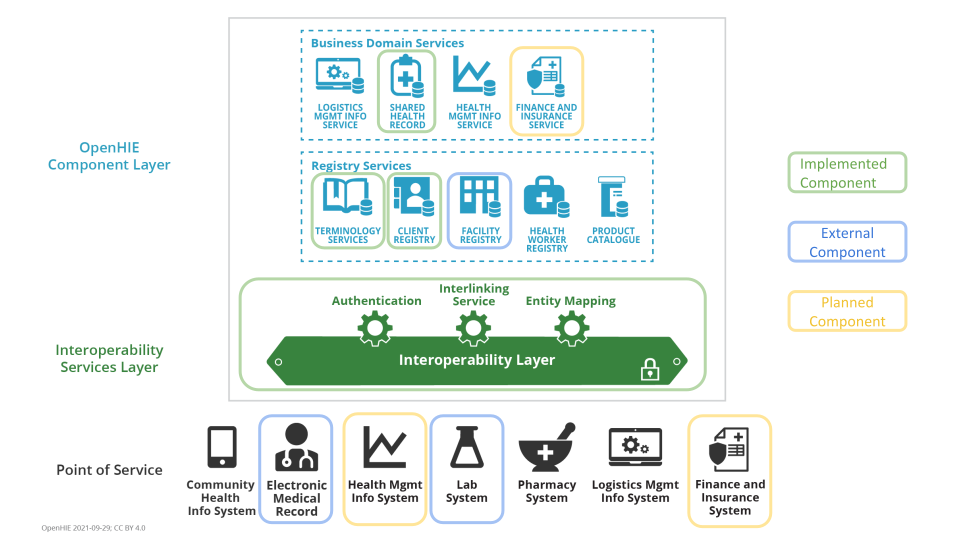

## Botswana HIE

**[Link to Github Repository](https://github.com/I-TECH-UW/hie-botswana)**

### Architecture

The Botswana HIE is based on the OpenHIE architecture. The following diagram shows the core components of the HIE architecture, and highlights the components currently in scope for implementation as part of the Botswana HIE project.

### Additional HIE Components 
- **Omang, BDRS, and Immigration API**: This mediator provides and interface for the Omang, BDRS, and Immigration databases. This mediator is implemented here (private repository): https://github.com/I-TECH-UW/OmangSVC

- **Reverse Proxies**
    * [Nginx](https://github.com/I-TECH-UW/hie-botswana/tree/main/reverse-proxy-nginx)
    * [Traefik](https://github.com/I-TECH-UW/hie-botswana/tree/pilot-3-traefik-v2/reverse-proxy-traefik)
    * [Caddy with WAF](https://github.com/I-TECH-UW/hie-botswana/tree/main/reverse-proxy-caddy)

- **Kafka:** https://github.com/I-TECH-UW/hie-botswana/tree/main/message-bus-kafka

- **HAPI FHIR Store:** https://github.com/I-TECH-UW/hie-botswana/blob/main/fhir-datastore-hapi-fhir/README.md

- **Monitoring for Kafka and Docker:** https://github.com/I-TECH-UW/hie-botswana/tree/main/monitoring

### Point of Service Applications 

- **PIMS:** This is a custom-built EMR used in Botswana.

- **Botswana EMR:** This is an OpenMRS-based EMR used in Botswana, and developed by BITRI.

- **IPMS:** This is a EMR and LIS system used in major facilities in Botswana developed by Meditech.

### Developer Guides

1. **[Botswana Laboratory Workflows](../../developer-guide/index.md#dev-guide-botsawana-laborabory-workflows)**

