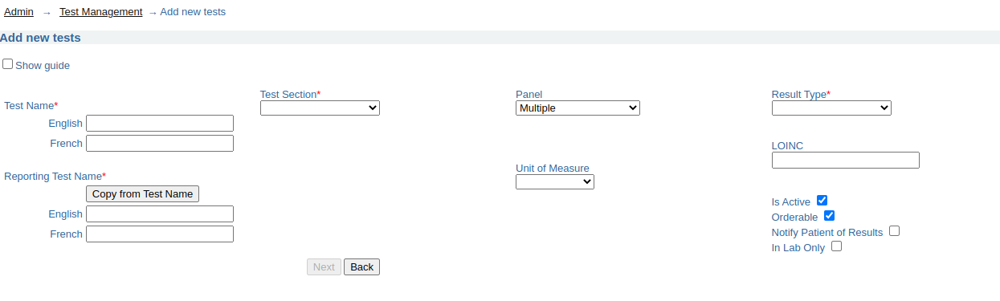

### Tutorial: Lab Order Communication between OpenMRS and OpenELIS

In this tutorial, we will use the resources from this documentation - with support from the [Laboratory Workflow Implementation Guide]() and [OpenHIE Architecture Specifications]() - to determine create a pilot implementation of **Lab Test Order and Result Communication** between an **Electronic Medical Record (EMR)** and a **Lab Information System**. We will use validated open-source solutions for each component of our pilot setup, and will use the OpenHIE specifications to guide our approach, the selection and roles of different components, and the language we use for disucssing the various concepts. 

To get a better idea about the concepts and data elements were using, visit the [Laboratory Workflows IG]() to a look at:
1. Our list of key concepts
2. Our logical model

We will focus on the following target architecture for our setup, which you can check out in the [IG]():

This architecture is based on the OpenHIE Specifications for Health Information Exchange components. For this tutorial, we
will focus on using OpenMRS the reference implementation of an OpenHIE EMR, and OpenELIS, the reference implementation of an OpenHIE LIS. 
#### Data Model


#### Openmrs 3.x

1. Setup OpenRMS 3.x on top an instance of the Reference Application 
*click here for [more infromation](https://wiki.openmrs.org/display/projects/3.x+Implementer+Documentation)*

1. [Install](https://wiki.openmrs.org/display/docs/Administering+Modules) the Following Modules
    * [FHIR2 module](https://github.com/openmrs/openmrs-module-fhir2) version  >= 1.5.0  
    * [Lab on FHIR](https://github.com/openmrs/openmrs-module-labonfhir) module 
    * [Order Entry Ui Module](https://github.com/openmrs/openmrs-module-orderentryui)
    * [Order Entry Owa](https://github.com/openmrs/openmrs-owa-orderentry)   

3. Configure the required settings 
    * `labonfhir.openElisUrl` ,The URL for the FHIR server where OpenELIS polls the Orders From.
    * `labonfhir.openElisUserUuid` ,UUID for the service user that represents OpenELIS     
    *[see more](https://github.com/openmrs/openmrs-module-labonfhir#usage) on Configuring the above Modules.*    
    *Note: The Lab test Concept should be of class `Test` ,and should be mapped to a  `Loinc code` that matches a the `Test Loinc Code` in OpenELIS*

4. Go to the Reff App (2.x) Patient Dashbord  `Prescribed Medication` Widget.
    
*see more on [Creating Orders](https://wiki.openmrs.org/display/projects/Order+Entry+UI+End+User+Guide+for+Creating+Drug+Orders) using the Order Entry Owa.*
   

    If the [Lab on FHIR](https://github.com/openmrs/openmrs-module-labonfhir) module is rightly configured ,it will generate the lab FHIR Bundle and push to the remote Fhir Server for OpenELIS to poll the orders

 5. Start up the OpenELIS Update Task
In order to be able to poll OpenELIS for available results, we need to turn on the following task in the OpenMRS scheduler:
`System Administration` → `Advanced Administration` → `Scheduler` → `Manage Scheduler`

6. Enable the [patient-test-results-app](https://github.com/openmrs/openmrs-esm-patient-chart/tree/master/packages/esm-patient-test-results-app) for the 3.x Frontenx.
Go to the Patient DashBoard in 3.x ui and click Test Results. 

#### iSantéPlus
1. Install iSantePlus using one of [these approaches](https://github.com/IsantePlus/isanteplus_installation#isanteplus-installation).
	

1. [Install](https://wiki.openmrs.org/display/docs/Administering+Modules) the Following Modules
    * [FHIR2 module](https://github.com/openmrs/openmrs-module-fhir2) version  >= 1.5.0 
    * [Lab on FHIR](https://github.com/openmrs/openmrs-module-labonfhir) module 
    * [IsantePlus FHIR Module](https://github.com/IsantePlus/openmrs-module-isanteplus-fhir)  
  Note : The above modules are installed by default by the docker setup 

2. Configure the required settings .
    * `labonfhir.openElisUrl` ,The URL for the FHIR server where OpenELIS polls the Orders From.
    * `labonfhir.openElisUserUuid` ,UUID for the service user that represents OpenELIS 

    [see more](https://github.com/openmrs/openmrs-module-labonfhir#usage) on Configuring the Lab On FHIR Modules.  

3. To place Lab Orders ,Fill  the `Laboratory Analysis Form`  , select OPenELIS as destination Lab and Save.     
`Find Patient` → `Patient DashBord` → `Forms` → `Laboratory Analysis`

NB. The Patient Must have an active vist

4. Start up the OpenELIS Update Task in order to poll for Completed Results from OpenELIS   
 `System Administration` → `Advanced Administration` → `Scheduler` → `Manage Scheduler`
 

5. To View The results ,Go to `Laboratory History` on the Patient DashBoard under General Actions.     
`Find Patient` → `Patient DashBord` → `Laboratory History`

#### OpenELIS Global 2.6.x 
The FHIR based Lab Workflow is supported in OpenELIS 2.6 .  

1. Start an instance of OpenELIS with the following configuration properties set in the properties file.

    * `org.openelisglobal.fhirstore.uri=<localFhirServerUrl>` . This is the Fhir Server that runs paralel with OPenELIS

    * `org.openelisglobal.remote.source.uri=<remoreFhirServerUr>`. This is the Fhir server that the Lab on FHIR module points to ie via the `labonfhir.openElisUrl`
    * `org.openelisglobal.remote.source.updateStatus=true`
    *  `org.openelisglobal.remote.source.identifier=Practitioner/<userUuuid>` .This is the UUID of the user who created the Order ie `labonfhir.openElisUserUuid`
    * `org.openelisglobal.task.useBasedOn=true`

    * `org.openelisglobal.fhir.subscriber=h<remoreFhirServerUrl>` .
    * `org.openelisglobal.fhir.subscriber.resources=Task,Patient,ServiceRequest,DiagnosticReport,Observation,Specimen,Practitioner,Encounter`

1. Ensure OpenELIS has the test that maps to the same LOINC code as the test Concept in OpenMRS.
This can be added via the  
 `Admin page` → `Test Management` → `Add Tests` 

1. Configure OpenELIS to accept electronic orders.   
`Admin` → `Order Entry Configuration` → `external orders`

1. Search for the Electronic Orders ie
 `Order` → `Electronic Orders` and then Complete the Order
Note that the user should have the right Lab Unit Priviledges to complete the Order

1. After Results are captured and Validated , OpenELIS sends back the results to OpenMRS as a Diagnostic Report with an Observation 
