# Overview

A critical workflow for high quality care is the timely and accurate exchange of laboratory orders and test results between the clinic and laboratories.  To digitize this workflow, you need an electronic medical record (EMR) capable of capturing orders, and a laboratory information system (LIS/LIMS) capable of order entry and capturing of test results associated with that order.  Using the most recent informatics standards, this digitized Lab Order and Results workflow SOP focuses on the use of FHIR and the OpenHIE architectural pattern for implementation, and includes several implementation approaches depending on context (i.e. direct bridge, older messaging standards only in the local systems).  This Lab Order and Results workflow utilizes the [FHIR Workflow Module](https://www.hl7.org/fhir/workflow-module.html) and suggested [Communication Patterns](https://www.hl7.org/fhir/workflow-communications.html#12.6.2.1) to implement the ordering of lab tests from an EMR to an LIS and resulting from LIS to EMR.

##Getting Started

To get started in implementing the EMR-LIS workflow between electronic systems, it is best to understand the full scope of high level steps that will possibly need to be done, depending on your situation in the environment you are implementing in.  In general, these high-level steps may need to be taken.  Details about each of these steps and the possible caveats will follow.

1. Identify the minimum data set to be exchanged between the systems.
2. Use a universally unique identification system (coding) for identifying and mapping lab tests for both systems.
3. Extract or create a laboratory test catalog from both the EMR and LIS.
4. Crosswalk the listing of lab tests between the EMR and LIS to map those lab tests to the unique ID system (coding).
5. Map all other relevant concepts and identifiers needed between EMR and LIS
6. Identify the data exchange method between the systems based on your HIE and infrastructure context. 
7. Build out the technological approach for the workflow within and between the EMR and LIS.
8. Identify and develop mechanisms for handling potential issues and caveats.


##Step by Step
###(1)Identify minimum dataset
Working with stakeholders, key partners, and system users, your team will need to identify the minimum data set to be exchanged between the systems.  Resources to inform the minimum data set could be paper forms that are used by providers for clinical orders, lab order and test result forms used by the laboratory, data sets from the EMR and LIS, and input from relevant technical working groups/steering committees, clinical partners and laboratory partners, and system users.  It is critical that the technical stewards / teams of the systems participate in this definition of the minimum data set to help determine what data is available in the systems, identify gaps in data or system abilities in capturing/providing that data, and feasibility in the system utilizing that data from the other system.

**Resources**

###(2)Use a universally unique identification system (coding) for identifying and mapping lab tests for both systems.

A common terminology is critical for systems to identify content within the messages sent to and received by each other.  Many EMR and LIS systems have not been built using the same terminology for the laboratory orders and results, and therefore, must be mapped to an agreed upon common terminology for that exchange.  To do this, your team will need to work with stakeholders and key partners to either create a local set of shared terminology that uses unique IDs for each term, or your team can utilize an international standard coding system to create this shared terminology set.  We recommend using the LOINC international standard for that shared terminology set of orders and results needed for your context.

**Resources** 
- [LOINC specification](https://loinc.org/)

###(3)Extract or create a laboratory test catalog from both the EMR and LIS.

In a spreadsheet or similar tool, create a line listing of the laboratory tests (and panels if used) from the EMR and from the LIS.  This test catalog will be used to map between the systems in step 4. 

**Resources**
- [Example: Haiti OpenELIS Lab System Test Catalog](https://docs.google.com/spreadsheets/d/1y9q42jMB2dTOClxJP3NU0UJ7xnX1qh_kCjlcNqBL49E/edit#gid=0)

###(4)Crosswalk the listing of lab tests between the EMR and LIS to map those lab tests to the unique ID system (coding)

In step #2, your team identified the shared terminology set that would stand as the source of truth for all terminologies that are exchanged in your HIE and provide unique identifiers for that terminology.  Using your laboratory test catalogs created in step #3, you will need to now map your lab tests and results from both the EMR and the LIS to the shared terminology set.  We recommend the use of LOINC codes as the mapping identifier.

Problem Solving: In some cases, the EMR may allow ordering tests by panel.  If the order only provides the panel and does not include individual tests, you will need to map panels to individual tests for the order and develop an additional mechanism to handle the translation for the proper exchange to the LIS.

**Resources**
- [Example: Botswana EMR-LIS Terminology Mapping](https://docs.google.com/spreadsheets/d/1jatq2MpMQPIrZvwCKeij6VEiNdPXaRcTTElJJG29dsM/edit#gid=0)
- [Example: Haiti iSantePlus Terminology Mapping to LOINC](https://docs.google.com/spreadsheets/d/1NgFUvbsDldy3N-xvsXntBMQ6CC1FCtqvchwpAjnzAkA/edit#gid=0)


###(5)Map all other relevant concepts and identifiers needed between EMR and LIS

Many times in systems that are not based on standards, the technical architectural decisions means the requirements for data fields may be different than the requirements in other systems for those data elements.  In these cases, when messages are exchanged between systems, those data elements that fit the requirements for the sending system do not meet the requirements for that data in the receiving system and will cause an error, and ultimately the transaction fails and the message and its data is not accepted into the receiving system.  To minimize errors of this type, ensure there is mapping of  all other relevant concepts between EMR and LIS.  Some of the most common concepts/data that might have issues do to requirements and algorithms tied to that data include (but are not limited to):
- Patient Identifiers
- Facility Identifiers
- System Identifiers

*Problem Solving: Many times the EMR and LIS have different required formats, lengths, or algorithms for identifiers that can cause errors and mismatches when messaging between systems.  There may be negotiating and workarounds that will need to be discussed and a mechanism for handling developed.  An example of this was in the Haiti iSantePlus (OpenMRS) exchange with a proprietary lab system that had specific algorithms attached to the patient identifiers fields in their database that caused a mismatch with the data sent.  In addition, there were other data elements that needed “massaging” due to character limits that don’t accommodate the full length of the data sent.  These types of issues needed extensive negotiation and custom development of how the data in the message would be constructed, formatted, and consumed in order to reliably exchange data between these systems.*


###(6)Identify the data exchange method between the systems based on your HIE and infrastructure context

There are multiple ways to approach the exchange of data, and will be decided by understanding the context in which your exchange will operate, and the requirements for data availability from the exchange.  You will use either a push of data from a system, or a pull of data from a system, or a mixed method approach depending on the implementation, system availability and connectivity, components available in the HIE, and requirements for timeliness and data availability from the exchange.  For example, you can set up your exchange of orders to use any of the following approaches:
- Push data from EMR to central repository (i.e. SHR), the central repository alerts the LIS, and subsequently the data is pulled by the LIS
- The LIS can periodically check for data to be pulled from an EMR or a central repository system (i.e. SHR), conducting the pull with all data with an order status of `ordered`
- An order is pushed by an EMR automatically to the LIS.  In this case, there is no way to know if the order reached the LIS or not.  We do not recommend this approach when using FHIR due to the lack of any receipt acknowledge messaging in the FHIR workflow standard.

###(7)Build out the technological approach for the workflow within and between the EMR and LIS

Use the technical artifacts in the Implementation Guide and the detailed technical sections in this SOP to develop and configure the EMR and LIS exchange.  Every EMR-LIS exchange is somewhat unique, and will require customization of these artifacts and approaches to meet the needs of the context you are working in.  For additional support during your build phase, engage with other developers and implementers in the relevant global goods communities of practice, such as OpenHIE LIS COP, OpenMRS FHIR Squad, and LIS software forums (i.e. OpenELIS).  Many folks are eager to share their experience and provide answers for how to use these technical artifacts and tools to achieve this exchange.  In addition, our team is happy to answer questions you may have when setting up your exchange following this guide.

**Resources**
- [OpenMRS FHIR Squad](https://wiki.openmrs.org/display/projects/OpenMRS+HL7+FHIR+Solutions), [FHIR Squad Bi-Weekly Calls](https://wiki.openmrs.org/display/projects/FHIR+Squad+Notes), and [Talk FHIR Forum](https://talk.openmrs.org/c/projects/fhir/52)
[OpenHIE LIS COP](https://wiki.ohie.org/pages/viewpage.action?pageId=36536662) and [Slack](https://ohieliscop.slack.com/)
[OpenELIS Forum](https://talk.openelisci.org/)


###(8)Identify and develop mechanisms for handling potential issues and caveats

Exchanges between EMR and LIS are not an easy thing to accomplish due to the many nuances to the workflows and the data collected and exchanged in the process.  Your team will need to identify additional potential issues for the exchange specific to the workflows you are addressing, and develop mechanisms to handle those.  Other problem areas to look for are, but no limited to:
- Canceled and Rejected lab orders
- Corrected Results after report out
- Specialized and interim/intermediate results (e.g., Microbiology)
- Ordering of test panels rather than individual lab tests
- Intermittent connectivity and infrastructure issues

##Communication Overview 
###Lab Orders

The lab order workflow follows the OpenHIE specification for standard lab ordering between an EMR and LIS. The workflow is detailed in the following sequence diagram:

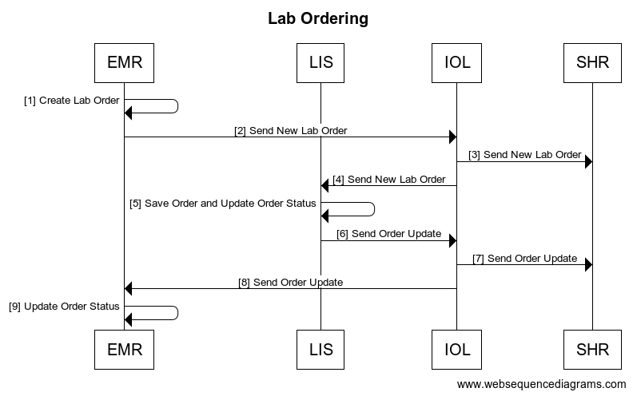

| | Interaction | Data| Transaction Options |
|---| ------ | ----------- | ----------- |
|1| Create Lab Order  | Order Save generates a new FHIR Task Bundled Order by creating a Task FHIR R4 Task Resource with a reference to a Service Request with order information |
|2| Send Lab Order | FHIR Task bundled order is sent to the IOL. Task status is aligned with the FHIR workflow communication pattern found [here](https://www.hl7.org/fhir/workflow-communications.html#12.6.2.1)|
|3,4 | Send New Lab Order   | Bundled order is routed through the IOL to both the SHR and the LIS |
|5 | Save Order and Update Order Status  | FHIR R4 Task Resource Status is updated locally to either `rejected` or `accepted`. A FHIR R4 ServiceRequest Resource (example) is created for order processing with a reference to the associated task. EMR test requests and LIS orders are matched based on LOINC codes.|
|6| Send New Lab Order   | Bundled order is routed through the IOL to both the SHR and the LIS |
|7,8| Send Order Update | IOL routes the updated FHIR R4 Tasks to the SHR and the EMR |
|9| Update FHIR Task Status| FHIR task status updated locally|

### Lab Results
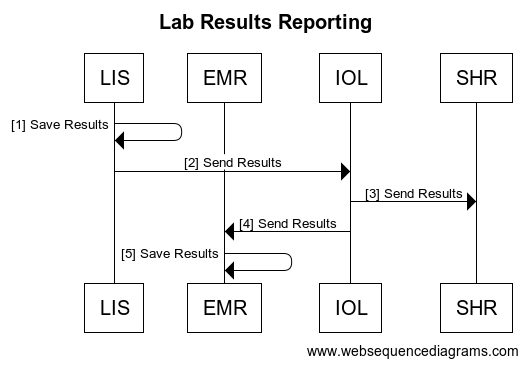

| | Interaction | Data| Transaction Options |
|---| ------ | ----------- | ----------- |
|1| Results Saved and FHIR Task Updated | The results save generates a FHIR R4 DiagnosticReport Resource () with referenced FHIR R4 Observation resources () to store the results,  and a reference to the associated Patient and Task Resource. ||
|2| Search for Updated FHIR Tasks || FHIR R4 Search for Tasks based on tasks for which the owner is the EMR, and which have a status ‘completed’ |
|3| Return FHIR Updated Tasks | FHIR R4 Task Resource with status ‘completed’ and reference to FHIR R4 DiagnosticReport | FHIR R4 bundle search response () |
|4| Search for Associated Diagnostic Reports || FHIR R4 Search for DiagnosticReports by UUID |
|5| Return Associated Diagnostic Reports | FHIR R4 DiagnosticReport Resource with ||
|6| Update FHIR Task Status, Store DiagnosticReports and Save Results ||||

## Case Study of OpenMRS and OpenELIS exchange
### Openmrs 3.x
1. Setup  OpenRMS 3.x on top an instance of the Refference Application see [more](https://wiki.openmrs.org/display/projects/3.x+Implementer+Documentation)

1. Load the Following Modules
    * [FHIR2 module](https://github.com/openmrs/openmrs-module-fhir2) version  >= 1.4.0 
    * [Lab on FHIR](https://github.com/openmrs/openmrs-module-labonfhir) module 
    * [Order Entry Ui Module](https://github.com/openmrs/openmrs-module-orderentryui)
    * [Order Entry Owa](https://github.com/openmrs/openmrs-owa-orderentry)   
1. Configure the required settings .
    * `labonfhir.openElisUrl` ,The URL for the FHIR server where OpenELIS polls the Orders From.
    * `labonfhir.openElisUserUuid` ,UUID for the service user that represents OpenELIS 

    [see more](https://github.com/openmrs/openmrs-module-labonfhir#usage) on Configuring the above Modules.  

    Note: The Lab test Concept should be of class `Test` ,and should be mapped to a  `Loinc code` that matches a the `Test Loinc Code` in OpenELIS


1. Go to the Reff App (2.x) Patient Dashbord ,Go to `Prescribed Medication` Widget.
  	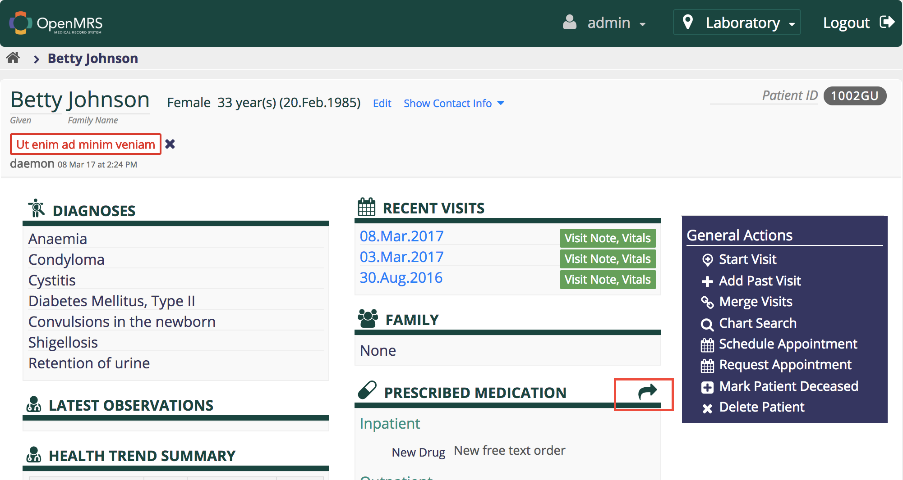 

	See more on [Creating Orders](https://wiki.openmrs.org/display/projects/Order+Entry+UI+End+User+Guide+for+Creating+Drug+Orders) using the Order           Entry Owa.

  
  	

1. If the [Lab on FHIR](https://github.com/openmrs/openmrs-module-labonfhir) module is rightly configured ,it will generate the lab FHIR Bundle and push to the remote Fhir Server for OpenELIS to poll the orders

1. Start up the OpenELIS Update Task in order to poll for Completed Results from OpenELIS    
`System Administration` → `Advanced Administration` → `Scheduler` → `Manage Scheduler`

	

1. To view the lab Results , Ensure you have the [patient-test-results-app](https://github.com/openmrs/openmrs-esm-patient-chart/tree/master/packages/esm-patient-test-results-app).
Go to the Patient DashBoard in 3.x ui and click Test Results. 
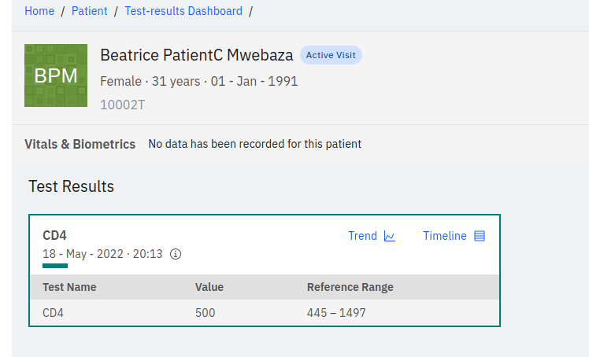

### iSantéPlus
1. Install iSantePlus using one of [these approaches](https://github.com/IsantePlus/isanteplus_installation#isanteplus-installation).
	

1. [Install](https://wiki.openmrs.org/display/docs/Administering+Modules) the Following Modules
    * [FHIR2 module](https://github.com/openmrs/openmrs-module-fhir2) version  >= 1.5.0 
    * [Lab on FHIR](https://github.com/openmrs/openmrs-module-labonfhir) module 
    * [IsantePlus FHIR Module](https://github.com/IsantePlus/openmrs-module-isanteplus-fhir)  
  Note : The above modules are installed by default by the docker setup 

1. Configure the required settings .
    * `labonfhir.openElisUrl` ,The URL for the FHIR server where OpenELIS polls the Orders From.
    * `labonfhir.openElisUserUuid` ,UUID for the service user that represents OpenELIS 

    [see more](https://github.com/openmrs/openmrs-module-labonfhir#usage) on Configuring the Lab On FHIR Modules.  

1. To place Lab Orders ,Fill  the `Laboratory Analysis Form`  , select OPenELIS as destination Lab and Save.     
`Find Patient` → `Patient DashBord` → `Forms` → `Laboratory Analysis`
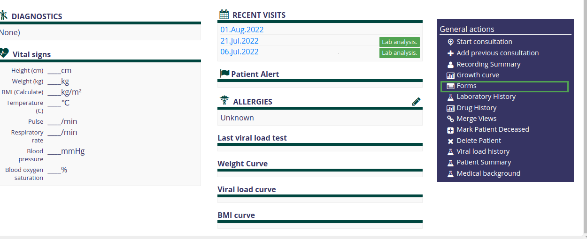
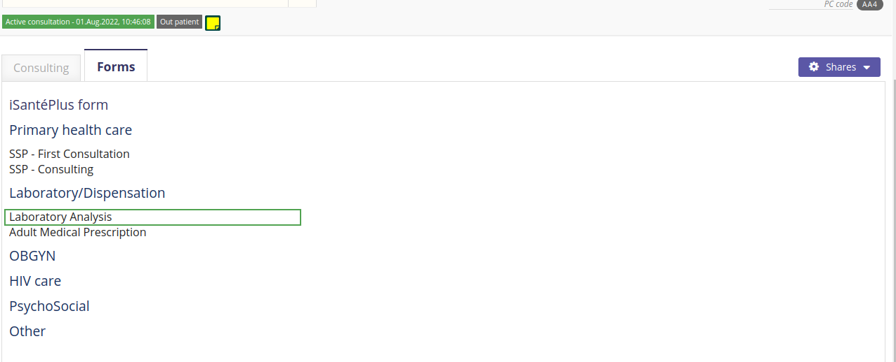
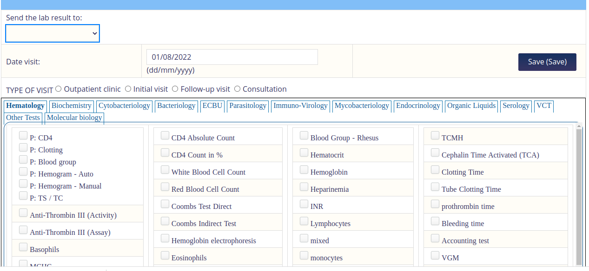
NB. The Patient Must have an active vist


1. Start up the OpenELIS Update Task in order to poll for Completed Results from OpenELIS   
 `System Administration` → `Advanced Administration` → `Scheduler` → `Manage Scheduler`
 

1. To View The results ,Go to `Laboratory History` on the Patient DashBoard under General Actions.     
`Find Patient` → `Patient DashBord` → `Laboratory History` → `Laboratory Analysis`
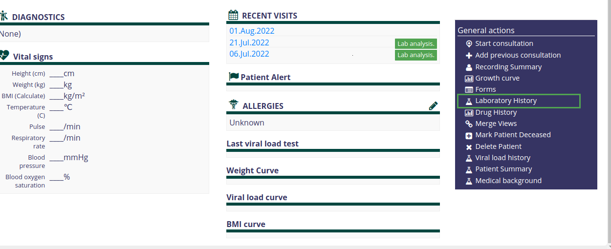
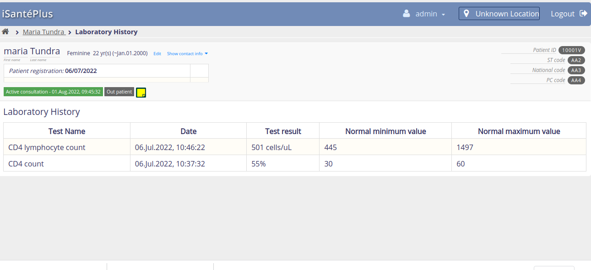

### OpenELIS Global 2.6.x 
The FHIR based Lab Workflow is supported in OpenELIS 2.6 .  

1. Start an instance of OpenELIS with the following configuration properties set in the properties file.

    * `org.openelisglobal.fhirstore.uri=<localFhirServerUrl>` . This is the Fhir Server that runs paralel with OPenELIS

    * `org.openelisglobal.remote.source.uri=<remoreFhirServerUr>`. This is the Fhir server that the Lab on FHIR module points to ie via the `labonfhir.openElisUrl`
    * `org.openelisglobal.remote.source.updateStatus=true`
    *  `org.openelisglobal.remote.source.identifier=Practitioner/<userUuuid>` .This is the UUID of the user who created the Order ie `labonfhir.openElisUserUuid`
    * `org.openelisglobal.task.useBasedOn=true`

    * `org.openelisglobal.fhir.subscriber=h<remoreFhirServerUrl>` .
    * `org.openelisglobal.fhir.subscriber.resources=Task,Patient,ServiceRequest,DiagnosticReport,Observation,Specimen,Practitioner,Encounter`

1. Ensure OpenELIS has the test that maps to the same LOINC code as the test Concept in OpenMRS.
This can be added via the  
 `Admin page` → `Test Management` → `Add Tests` 
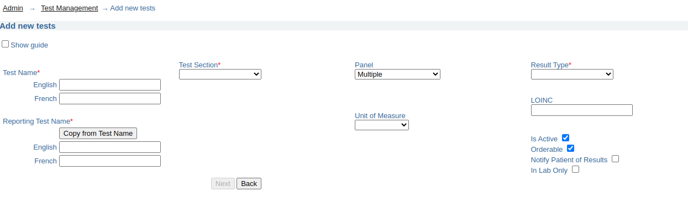

1. Configure OpenELIS to accept electronic orders.   
`Admin` → `Order Entry Configuration` → `external orders`


1. Search for the Electronic Orders ie
 `Order` → `Electronic Orders` and then Complete the Order
Note that the user should have the right Lab Unit Priviledges to complete the Order
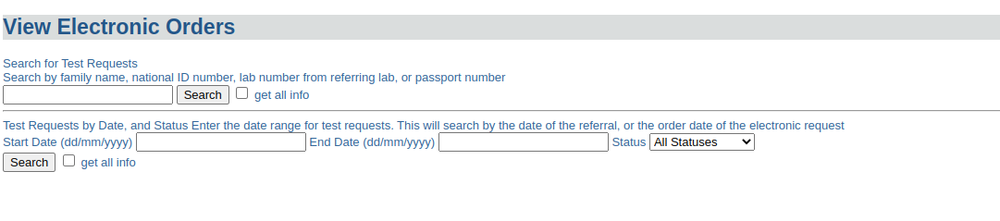

1. After Results are captured and Validated , OpenELIS sends back the results to OpenMRS as a Diagnostic Report with an Observation 

##Required FHIR Resources
###Task
> [more info](https://wiki.openmrs.org/display/projects/Task+Resource)

The Task resource is created along with the corresponding ServiceRequest resource when a clinician creates a TestOrder and decides to send it to OpenELIS.

This resource is used to track the status of the lab order request from initiation to completion, and as a container for all other resources related to the given order.

*Example Task:*
```
{
    "resourceType": "Task",
    "id": "88ffa7fb-0419-4097-8b45-24f0d843c5ea",
    "identifier": [
        {
            "system": "http://isanteplus.org/ext/task/identifier",
            "value": "88ffa7fb-0419-4097-8b45-24f0d843c5ea"
        }
    ],
    "basedOn": [
        {
            "reference": "ServiceRequest/ebf83ba0-9d3c-497f-9aa0-d839ec506202",
            "type": "ServiceRequest"
        },
        {
            "reference": "ServiceRequest/73e96ecb-a78d-41c8-a55f-d9b90f759e5f",
            "type": "ServiceRequest"
        }
    ],
    "status": "requested",
    "intent": "order",
    "for": {
        "reference": "Patient/e14e9bda-d273-4c74-8509-5732a4ebaf19",
        "type": "Patient"
    },
    "encounter": {
        "reference": "Encounter/7f5aabd9-6375-47c8-a8d6-30f219b6e2f1",
        "type": "Encounter"
    },
    "authoredOn": "2020-04-28T17:33:19+00:00",
    "owner": {
        "reference": "Practitioner/f9badd80-ab76-11e2-9e96-0800200c9a66",
        "type": "Practitioner"
    }
}
```
###ServiceRequest
> [more info](https://wiki.openmrs.org/display/projects/ServiceRequest+Resource)

The ServiceRequest resource represents the TestOrder placed in OpenMRS. It is referenced from the Task with the Task.basedOn element, and sent to OpenELIS with the Task to initiate the processing of the order. 

*Example Service Request:*
```
{
    "resourceType": "ServiceRequest",
    "id": "73e96ecb-a78d-41c8-a55f-d9b90f759e5f",
    "status": "active",
    "intent": "order",
    "code": {
        "coding": [
            {
                "code": "790AAAAAAAAAAAAAAAAAAAAAAAAAAAAAAAAA"
            },
            {
                "system": "http://loinc.org",
                "code": "14682-9"
            },
            {
                "system": "urn:oid:2.16.840.1.113883.3.7201",
                "code": "790"
            }
        ]
    },
    "subject": {
        "reference": "Patient/e14e9bda-d273-4c74-8509-5732a4ebaf19",
        "type": "Patient"
    },
    "encounter": {
        "reference": "Encounter/7f5aabd9-6375-47c8-a8d6-30f219b6e2f1",
        "type": "Encounter"
    }
}
```
###DiagnosticReport
> [more info](https://wiki.openmrs.org/display/projects/DiagnosticReport+Resource)

The DiagnosticReport resource  is the container for the results of an Order, and holds these results in the DiagnosticReport.result element as references to Observation resources. 

*Example Diagnostic Report*
```
{
  "resourceType": "DiagnosticReport",
  "id": "93",
  "meta": {
    "versionId": "1",
    "lastUpdated": "2020-04-28T17:33:36.163+00:00",
    "source": "#55t4lpDZF4q3TCZ0"
  },
  "text": {
    "status": "generated",
    "div": "<div xmlns=\"http://www.w3.org/1999/xhtml\"><div class=\"hapiHeaderText\"> Untitled Diagnostic Report </div><table class=\"hapiPropertyTable\"><tbody><tr><td>Status</td><td>FINAL</td></tr></tbody></table></div>"
  },
  "identifier": [
    {
      "system": "https://isanteplusdemo.com/openmrs/ws/fhir2/",
      "value": "ebf83ba0-9d3c-497f-9aa0-d839ec506202"
    }
  ],
  "status": "final",
  "code": {
    "coding": [
      {
        "code": "1008AAAAAAAAAAAAAAAAAAAAAAAAAAAAAAAA"
      },
      {
        "system": "http://loinc.org",
        "code": "22748-8"
      },
      {
        "system": "urn:oid:2.16.840.1.113883.3.7201",
        "code": "1008"
      }
    ]
  },
  "subject": {
    "reference": "Patient/2"
  },
  "result": [
    {
      "reference": "Observation/92",
      "type": "Observation"
    }
  ]
}
```
###Observation
> [more info](https://wiki.openmrs.org/display/projects/Observation+Resource)

The Observation resource contains the results of the Lab Order request.

*Example Observation:*

```
{
  "resourceType": "Observation",
  "id": "92",
  "meta": {
    "versionId": "1",
    "lastUpdated": "2020-04-28T17:33:36.124+00:00",
    "source": "#xAVz0uUE6c3l42Za"
  },
  "identifier": [
    {
      "system": "https://isanteplusdemo.com/openmrs/ws/fhir2/",
      "value": "ebf83ba0-9d3c-497f-9aa0-d839ec506202"
    }
  ],
  "status": "final",
  "code": {
    "coding": [
      {
        "code": "1008AAAAAAAAAAAAAAAAAAAAAAAAAAAAAAAA"
      },
      {
        "system": "http://loinc.org",
        "code": "22748-8"
      },
      {
        "system": "urn:oid:2.16.840.1.113883.3.7201",
        "code": "1008"
      }
    ]
  },
  "subject": {
    "reference": "Patient/2"
  },
  "valueQuantity": {
    "value": 55,
    "unit": "UI/L"
  }
}
```
###Patient

> [more info](https://wiki.openmrs.org/display/projects/Patient+Resource)

The Patient resource contains vital information for OpenELIS to fullfill the lab order request, and is referenced by the Task.

Example Patient:

```
{
    "resourceType": "Patient",
    "id": "e14e9bda-d273-4c74-8509-5732a4ebaf19",
    "identifier": [
        {
            "id": "5981a256-d60c-44b1-beae-9bdd2cf572f8",
            "use": "official",
            "system": "iSantePlus ID",
            "value": "10012R"
        },
        {
            "id": "75a67d54-6fff-44d1-9c3e-2116c967b475",
            "use": "usual",
            "system": "Code National",
            "value": "100000"
        },
        {
            "id": "29447d21-3cd6-42a9-9ab2-79ebfa710a01",
            "use": "usual",
            "system": "ECID",
            "value": "04d759e0-5d02-11e8-b899-0242ac12000b"
        }
    ],
    "active": true,
    "name": [
        {
            "id": "511275de-e301-44a3-95d2-28d0d3b35387",
            "family": "Mankowski",
            "given": [
                "Piotr"
            ]
        }
    ],
    "gender": "male",
    "birthDate": "1987-01-01",
    "deceasedBoolean": false,
    "address": [
        {
            "id": "d4f7c809-3d01-4032-b64d-4c22e8eccbbc",
            "use": "home",
            "country": "Haiti"
        }
    ]
}

```

##Relevant FHIR Docs
* [Using Tasks in a RESTful Context](https://www.hl7.org/fhir/task.html#12.1.2.1)
* [Workflow Module](https://www.hl7.org/fhir/workflow-module.html)
* [Diagnostic Module](https://www.hl7.org/fhir/diagnostics-module.html)
* [Example: Workflow states for a lab order for a blood test](https://www.hl7.org/fhir/workflow-communications.html#12.6.2.1)
* [Option G: POST of Task to fulfiller's system](https://www.hl7.org/fhir/workflow-management.html#optiong)

##Relevant OpenMRS Talk Posts
[The handling and mapping of lab order status for the lab workflow](https://talk.openmrs.org/t/the-handling-and-mapping-of-lab-order-status-for-the-lab-workflow/26348)


 
